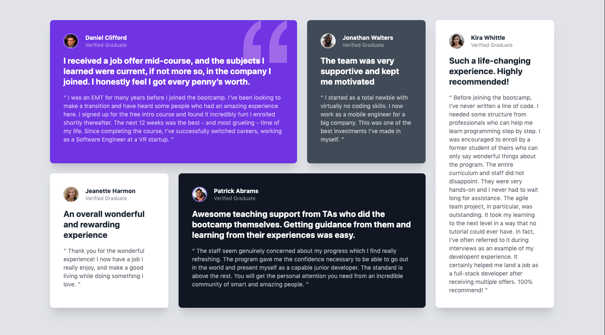

# Testimonials Grid Section solution using Tailwind CSS & HTML

This is a solution to the [Testimonials grid section challenge on Frontend Mentor](https://www.frontendmentor.io/challenges/testimonials-grid-section-Nnw6J7Un7).

## Table of contents

- [Overview](#overview)
  - [The challenge](#the-challenge)
  - [Screenshot](#screenshot)
  - [Links](#links)
- [My process](#my-process)
  - [Built with](#built-with)
  - [What I learned](#what-i-learned)
  - [Continued development](#continued-development)
  - [Useful resources](#useful-resources)
- [Author](#author)

## Overview

### The challenge

Users should be able to:

- View the optimal layout for the site depending on their device's screen size

### Screenshot

### Links

- Solution URL: [https://github.com/kbrandon19/Testimonial-Grid](https://github.com/kbrandon19/Testimonial-Grid)
- Live Site URL: [https://kbrandon19.github.io/Testimonial-Grid/](https://kbrandon19.github.io/Testimonial-Grid/)

## My process

### Built with

- Tailwind CSS
- CSS Grid
- Mobile-first workflow

### What I learned

I decided to try my hand at completing this task using Tailwind CSS. The concept is quite easy and straight forward when it come to adding the styling with only classes. Having the documentation next to me I was able to create it as close to the design as possible.

### Continued development

There are a ton of things I still have left to learn within Tailwind CSS but overall I am happy with the outcome and I plan on using Tailwind CSS for future projects. 

### Useful resources

- [Tailwind Documentation](https://tailwindcss.com/docs) - This helped me become more familiar with the naming conventions of each styling class within Tailwind CSS.

## Author

- Frontend Mentor - [@kbrandon19](https://www.frontendmentor.io/profile/kbrandon19)
- Twitter - [@MrDebonairFox](https://www.twitter.com/MrDebonairFox)

